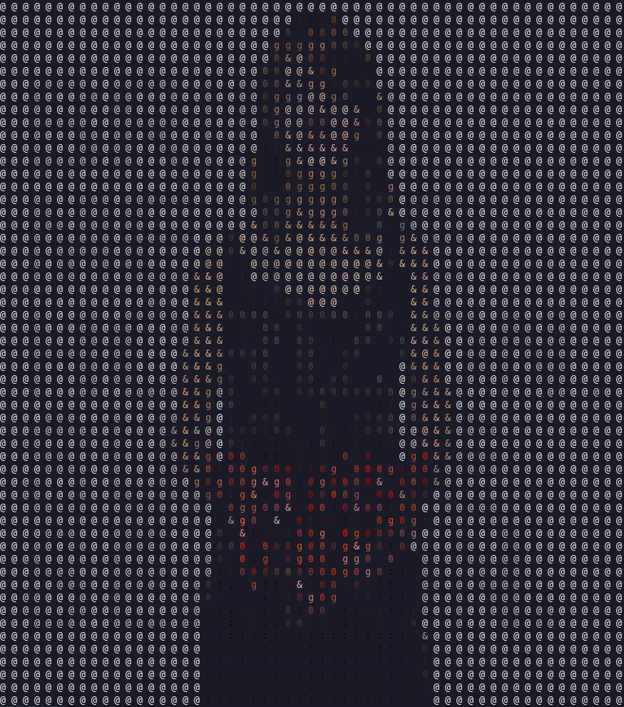
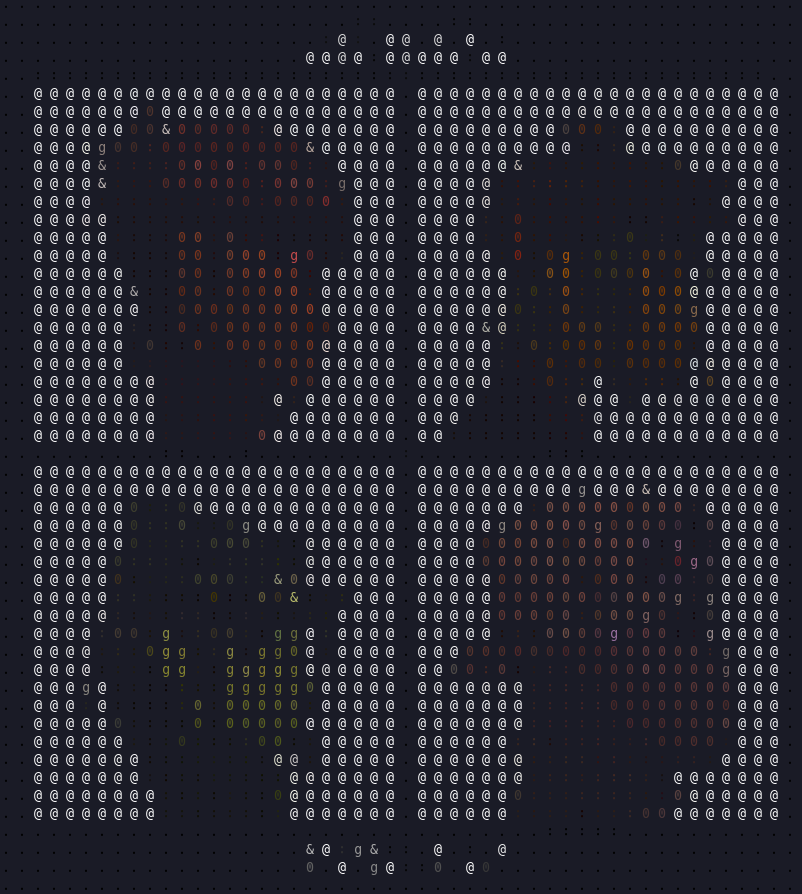
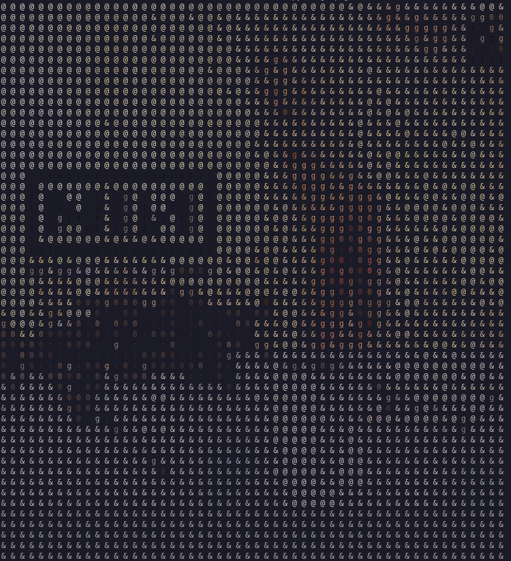

# Treminal Image Display
This program shows image in terminal by converting pixels into symbols.

## Usage
``` python
python3 main.py <path_to_image>
python3 main.py <path_to_image> <crop_paramter>
```
## Parameters
- -help or --h - show help message
- <image_path> - path of image that will be displayed 
- <crop_parameter> - number that shows how lines need to delete from result text (it let image fit into terminal)

## Examples
  




